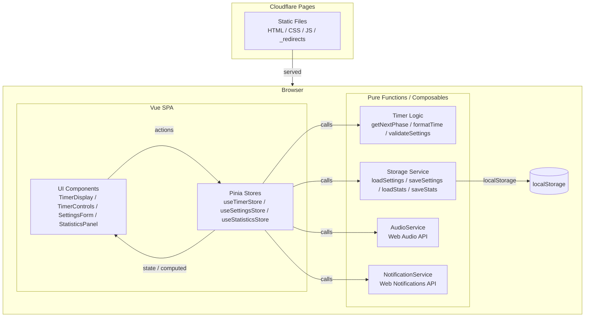
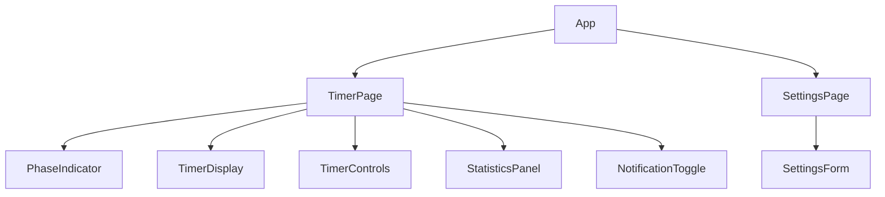

# テクニカルデザインドキュメント — ポモドーロタイマー SPA

## Overview

本ドキュメントは、要件定義書 (`requirements.md`) に基づいて実装するポモドーロタイマー SPA のアーキテクチャと技術設計を定義する。

アプリは **Vite + Vue 3 + TypeScript** で構築し、**Cloudflare Pages** 上に静的ファイルとしてデプロイする。外部バックエンドは持たず、全ての永続化は `localStorage` で完結する。

### 主要な技術スタック

| 役割 | 採用技術 | 理由 |
|------|----------|------|
| ビルドツール | [Vite](https://vitejs.dev/) | 高速な HMR、静的ビルド出力、Cloudflare Pages との親和性 |
| UI フレームワーク | [Vue 3](https://vuejs.org/) + TypeScript (Composition API) | リアクティブシステムが組み込み、型安全性、`<script setup>` による簡潔な記述 |
| 状態管理 | [Pinia](https://pinia.vuejs.org/) | Vue 公式状態管理、Composition API との親和性、DevTools 統合 |
| スタイリング | CSS Modules | バンドルサイズゼロ、スコープ付きスタイル |
| テスト | [Vitest](https://vitest.dev/) + [@testing-library/vue](https://testing-library.com/docs/vue-testing-library/intro/) + [fast-check](https://github.com/dubzzz/fast-check) | Vite と同一設定で動作、PBT 対応 |
| デプロイ | [Cloudflare Pages](https://pages.cloudflare.com/) | 静的ホスティング、グローバル CDN |

---

## Architecture

アプリは単一ページアプリケーションとして動作し、全てのロジックはブラウザで実行される。



### データフロー

1. ユーザーがボタンを操作 → UI から Pinia Store の action を呼び出す
2. Store がタイマーロジック（純粋関数）を適用して新しい状態を計算する
3. Store が副作用サービス（Storage / Audio / Notification）を呼び出す
4. Vue がリアクティブな状態変化に応じて UI を自動更新する

---

## Components and Interfaces

### コンポーネント階層



### 主要コンポーネント

Vue 3 では `<script setup lang="ts">` を使用し、props は `defineProps<T>()`、emits は `defineEmits<T>()` で型付けする。

#### `TimerDisplay.vue`

現在のフェーズ名と残り時間（MM:SS 形式）を表示する。`aria-live="polite"` 領域でスクリーンリーダーに読み上げられる（フェーズ変更時のみ `aria-live="assertive"`）。

```typescript
// Props
interface TimerDisplayProps {
  phase: Phase;
  secondsRemaining: number;
  isRunning: boolean;
}
```

```vue
<script setup lang="ts">
const props = defineProps<TimerDisplayProps>();
</script>
```

#### `TimerControls.vue`

スタート・一時停止・リセットボタンを提供する。全ボタンは `type="button"` を持ち、キーボード操作（Enter / Space）に対応する。

```typescript
// Props & Emits
interface TimerControlsProps {
  isRunning: boolean;
}
// emits: 'start' | 'pause' | 'reset'
```

```vue
<script setup lang="ts">
const props = defineProps<TimerControlsProps>();
const emit = defineEmits<{
  start: [];
  pause: [];
  reset: [];
}>();
</script>
```

#### `PhaseIndicator.vue`

現在のサイクル内で何番目のセッションかをドット（◉/○）で示す。

```typescript
interface PhaseIndicatorProps {
  completedInCycle: number;   // 現在サイクル内の完了数
  sessionsPerCycle: number;
}
```

#### `SettingsForm.vue`

各フェーズ時間と 1 サイクルあたりセッション数を編集するフォーム。入力値の範囲バリデーションをリアルタイムで行い、範囲外の場合はエラーメッセージを表示して保存ボタンを無効化する。

```typescript
interface SettingsFormProps {
  currentSettings: Settings;
}
// emits: 'save' with Settings payload
```

```vue
<script setup lang="ts">
const props = defineProps<SettingsFormProps>();
const emit = defineEmits<{
  save: [settings: Settings];
}>();
</script>
```

#### `StatisticsPanel.vue`

当日の完了セッション数を表示する読み取り専用パネル。

```typescript
interface StatisticsPanelProps {
  todayCount: number;
}
```

---

## Data Models

### `Phase` — フェーズ列挙

```typescript
type Phase = 'session' | 'shortBreak' | 'longBreak';
```

### `Settings` — ユーザー設定

```typescript
interface Settings {
  sessionMinutes: number;       // 1〜60
  shortBreakMinutes: number;    // 1〜30
  longBreakMinutes: number;     // 1〜60
  sessionsPerCycle: number;     // 1〜8
  notificationsEnabled: boolean;
}

const DEFAULT_SETTINGS: Settings = {
  sessionMinutes: 25,
  shortBreakMinutes: 5,
  longBreakMinutes: 15,
  sessionsPerCycle: 4,
  notificationsEnabled: true,
};
```

localStorage キー: `pomodoro-settings`（JSON 文字列として保存）

### `TimerState` — タイマー状態

```typescript
interface TimerState {
  phase: Phase;
  secondsRemaining: number;
  isRunning: boolean;
  completedSessions: number;     // アプリ起動後の累計
}
```

### `Statistics` — 統計データ

```typescript
interface Statistics {
  date: string;        // "YYYY-MM-DD"（ローカルタイムゾーン）
  todayCount: number;
}
```

localStorage キー: `pomodoro-statistics`（JSON 文字列として保存）

### Pinia Store インターフェース

Pinia では `defineStore` を使い、`state`・`getters`・`actions` を Option Store または Setup Store スタイルで定義する。本プロジェクトでは Composition API との親和性を重視して **Setup Store** スタイルを採用する。

```typescript
// useTimerStore
export const useTimerStore = defineStore('timer', () => {
  // state (ref)
  const phase = ref<Phase>('session');
  const secondsRemaining = ref<number>(0);
  const isRunning = ref<boolean>(false);
  const completedSessions = ref<number>(0);

  // getters (computed)
  const formattedTime = computed(() => formatTime(secondsRemaining.value));
  const formattedTitle = computed(() => formatTitle(phase.value, secondsRemaining.value));

  // actions
  function start(): void { /* ... */ }
  function pause(): void { /* ... */ }
  function reset(): void { /* ... */ }
  function tick(): void { /* setInterval から 1 秒ごとに呼ばれる */ }
  function saveSettings(s: Settings): void { /* ... */ }

  return { phase, secondsRemaining, isRunning, completedSessions,
           formattedTime, formattedTitle, start, pause, reset, tick, saveSettings };
});
```

### 純粋ロジック関数

```typescript
// フェーズ遷移を計算する
function getNextPhase(
  currentPhase: Phase,
  completedSessions: number,
  sessionsPerCycle: number
): Phase;

// 秒数を MM:SS 文字列に変換する
function formatTime(totalSeconds: number): string;

// タブタイトル用文字列を生成する
function formatTitle(phase: Phase, totalSeconds: number): string;

// 設定値のバリデーション
function validateSettings(s: Settings): ValidationResult;

// セッションインジケーターの状態配列を生成する
function getIndicatorStates(completedInCycle: number, sessionsPerCycle: number): boolean[];

// 2 つの YYYY-MM-DD 文字列が同じ日かを判定する
function isSameDay(a: string, b: string): boolean;

// 今日の日付文字列（ローカルタイムゾーン）を取得する
function getTodayString(): string;
```

---

## Correctness Properties

*A property is a characteristic or behavior that should hold true across all valid executions of a system — essentially, a formal statement about what the system should do. Properties serve as the bridge between human-readable specifications and machine-verifiable correctness guarantees.*

### Property 1: formatTime のラウンドトリップ整合性

*For any* 0 以上 5999 以下の整数 `seconds`、`formatTime(seconds)` が返す文字列 `"MM:SS"` をパースして `M*60+S` を計算したとき、元の `seconds` と等しくなる。また文字列は `/^\d{2}:\d{2}$/` のパターンに一致する。

**Validates: Requirements 1.1**

---

### Property 2: リセット後の残り時間は設定値と一致する

*For any* 合法な `Settings` と任意の `Phase`、`reset()` を呼んだ後の `secondsRemaining` は `settings[phase + 'Minutes'] * 60` と等しい。

**Validates: Requirements 1.4**

---

### Property 3: フェーズ遷移ロジックの正確性

*For any* `completedSessions >= 1` かつ `sessionsPerCycle in 1..8` の整数の組み合わせについて、セッション完了後の次フェーズは以下の条件を常に満たす。

- `completedSessions % sessionsPerCycle === 0` のとき → `'longBreak'`
- `completedSessions % sessionsPerCycle !== 0` のとき → `'shortBreak'`
- `currentPhase` が `'shortBreak'` または `'longBreak'` のとき → `'session'`

**Validates: Requirements 2.2, 2.3, 2.4**

---

### Property 4: 設定バリデーションの境界整合性

*For any* `Settings` オブジェクトについて、`validateSettings` が `valid` を返すのは以下の全条件が満たされる場合かつその場合に限る。

- `sessionMinutes in [1, 60]`
- `shortBreakMinutes in [1, 30]`
- `longBreakMinutes in [1, 60]`
- `sessionsPerCycle in [1, 8]`

すなわち、合法な範囲内の入力に対しては必ず `valid: true` を返し、境界を 1 でも超えた入力に対しては必ず `valid: false` を返す。

**Validates: Requirements 3.1, 3.2, 3.3, 3.4, 3.7**

---

### Property 5: 設定のシリアライズ・デシリアライズ ラウンドトリップ

*For any* 合法な `Settings` オブジェクト `s`、`deserializeSettings(serializeSettings(s))` は `s` と深く等しくなる（`JSON.parse(JSON.stringify(s))` に相当する構造等価性）。

**Validates: Requirements 3.5, 4.3**

---

### Property 6: 統計のシリアライズ・デシリアライズ ラウンドトリップ

*For any* `Statistics` オブジェクト `st`、`deserializeStatistics(serializeStatistics(st))` は `st` と等しくなる。

**Validates: Requirements 6.6**

---

### Property 7: `isSameDay` の対称性

*For any* 2 つの YYYY-MM-DD 形式の日付文字列 `a`, `b`、`isSameDay(a, b) === isSameDay(b, a)` が常に成立する（対称律）。また `isSameDay(a, a)` は常に `true` を返す（反射律）。

**Validates: Requirements 6.1, 6.5**

---

### Property 8: セッションインジケーター配列の不変条件

*For any* `completedInCycle in 0..sessionsPerCycle-1` と `sessionsPerCycle in 1..8` について、`getIndicatorStates(completedInCycle, sessionsPerCycle)` が返す配列は長さが `sessionsPerCycle` であり、最初の `completedInCycle` 個が `true`、残りが `false` である。

**Validates: Requirements 2.6**

---

### Property 9: タイトルフォーマットの構造不変条件

*For any* 有効な `Phase` と 0 以上 5999 以下の整数 `seconds`、`formatTitle(phase, seconds)` が返す文字列は `formatTime(seconds)` の出力を含む。

**Validates: Requirements 1.6**

---

### Property 10: tick() のカウントダウン不変条件

*For any* 合法な `Settings` と任意の `Phase`、`reset()` 直後の `secondsRemaining`（= 現在フェーズの分数 × 60）から `tick()` を N 回（N < 初期残り秒数）呼んだとき、`secondsRemaining` はちょうど N 減少し、決して負にならない。また残り時間が 0 の状態で休憩フェーズ（`shortBreak` / `longBreak`）から `tick()` を呼ぶと、必ず `session` フェーズへ遷移し、`secondsRemaining` は次フェーズの初期時間へリセットされる。連続 `tick()` ではフェーズを跨いでも `secondsRemaining >= 0` が常に成立する。

**Validates: Requirements 1.2, 1.5, 2.4**

---

### Property 11: 統計インクリメントの加法不変条件

*For any* 非負の初期カウントと `n >= 1`、`incrementToday()` を n 回呼ぶと `todayCount` は初期値からちょうど n 増え、その値が今日の日付とともに `pomodoro-statistics` に保存される。また `session` フェーズで残り 0 から `tick()` を n 回完了させると、`completedSessions` と `todayCount` はともにちょうど n 増える。

**Validates: Requirements 2.1, 6.3**

---

### Property 12: 設定の永続化ラウンドトリップ

*For any* 合法な `Settings` オブジェクト `s`、`saveSettings(s)` の後に `loadSettings()` を呼ぶと `s` と深く等しい値が返る。ストレージが空の場合は常に `DEFAULT_SETTINGS` が返る。

**Validates: Requirements 4.1, 4.2**

---

### Property 13: 統計の日付リセット不変条件

*For any* `Statistics`、保存日付が今日と一致する場合は `loadStatistics()` は任意の `todayCount` をそのまま返す。保存日付が前日以前の場合は `todayCount` を必ず 0 にリセットし、日付を今日に更新して返す。

**Validates: Requirements 6.4, 6.5**

---

## Error Handling

### 設定値バリデーションエラー

- `validateSettings` が `valid: false` を返した場合、`SettingsForm.vue` は各フィールドにインラインエラーメッセージを表示し、保存ボタンを無効化する。
- タイマーの状態には影響しない（キャンセル操作と同等）。

### localStorage アクセスエラー

- `localStorage` が利用不可の場合（プライベートブラウジング制限など）、`try/catch` で捕捉してアプリのデフォルト値を使い続ける。
- ユーザーへの通知は「設定が保存されません」旨のバナーを 1 度だけ表示する。

### Web Audio API エラー

- `AudioContext` の生成や `OscillatorNode` の再生に失敗した場合（古いブラウザ、ユーザーのミュート設定など）は silent fail とし、タイマー動作には影響しない。
- ブラウザの autoplay policy により `AudioContext` が suspended 状態になった場合は、ユーザーの最初のインタラクション（ボタンクリック）で `resume()` を試みる。

### Web Notifications API エラー

- `Notification.permission === 'denied'` の場合は通知リクエストを送らず、サウンドのみで通知する（要件 5.4）。
- `Notification` API が存在しないブラウザ（Safari 古バージョンなど）では、サウンドのみで代替する。

### 統計の日付ズレ

- アプリ起動時に `Statistics.date` と当日の日付を `isSameDay` で比較し、不一致の場合は `todayCount` を 0 にリセットして localStorage を上書きする（要件 6.5）。

---

## Testing Strategy

### 二重テスト戦略

本プロジェクトはユニットテストとプロパティベーステスト（PBT）を組み合わせて使用する。

- **ユニットテスト（example-based）**: 具体的な例、エッジケース、副作用が絡む処理
- **プロパティベーステスト（PBT）**: 純粋関数の普遍的性質（上記 Correctness Properties セクション参照）

### ツール構成

```
vitest                   — テストランナー（Vite と共通設定）
@testing-library/vue     — コンポーネントテスト（Vue 3 対応）
fast-check               — プロパティベーステスト（PBT）
jsdom                    — ブラウザ環境エミュレーション
@vue/test-utils          — @testing-library/vue の内部依存、直接利用も可
```

### ディレクトリ構成

```
src/
  lib/
    timer.ts            — getNextPhase, formatTime, formatTitle, getIndicatorStates
    validation.ts       — validateSettings
    storage.ts          — serializeSettings, deserializeSettings, serializeStatistics, ...
    date.ts             — isSameDay, getTodayString
  stores/
    timerStore.ts       — useTimerStore (Pinia Setup Store)
    settingsStore.ts    — useSettingsStore
    statisticsStore.ts  — useStatisticsStore
  components/
    TimerDisplay.vue
    TimerControls.vue
    PhaseIndicator.vue
    SettingsForm.vue
    StatisticsPanel.vue
  __tests__/
    lib/
      timer.property.test.ts               — Property 1, 3, 8, 9 (PBT)
      validation.property.test.ts          — Property 4 (PBT)
      storage.property.test.ts             — Property 5, 6 (PBT)
      storage.persistence.property.test.ts — Property 12, 13 (PBT)
      date.property.test.ts                — Property 7 (PBT)
    stores/
      timerStore.unit.test.ts              — ユニットテスト（start/pause/reset/tick）
      timerStore.property.test.ts          — Property 2 (PBT)
      timerStore.tick.property.test.ts     — Property 10 (PBT)
      statisticsStore.property.test.ts     — Property 11 (PBT)
    components/
      TimerDisplay.test.ts        — aria-live, aria-label 確認
      SettingsForm.test.ts        — バリデーションエラー表示
```

### Pinia テストセットアップ

Vitest + `@testing-library/vue` で Pinia を使用するには、各テストで `createPinia()` を作成して `setActivePinia` またはプラグインとして渡す。

```typescript
import { setActivePinia, createPinia } from 'pinia';
import { beforeEach, describe, it, expect } from 'vitest';
import { useTimerStore } from '../stores/timerStore';

describe('useTimerStore', () => {
  beforeEach(() => {
    setActivePinia(createPinia());
  });

  it('start() sets isRunning to true', () => {
    const store = useTimerStore();
    store.start();
    expect(store.isRunning).toBe(true);
  });
});
```

### PBT 設定

各プロパティテストは **fast-check** で最低 **100 イテレーション** 実行する。

```typescript
// 例: Property 1
// Feature: pomodoro-timer, Property 1: formatTime のラウンドトリップ整合性
import * as fc from 'fast-check';
import { formatTime } from '../lib/timer';

test('formatTime round-trips through parse', () => {
  fc.assert(
    fc.property(fc.integer({ min: 0, max: 5999 }), (seconds) => {
      const formatted = formatTime(seconds);
      expect(formatted).toMatch(/^\d{2}:\d{2}$/);
      const [mm, ss] = formatted.split(':').map(Number);
      expect(mm * 60 + ss).toBe(seconds);
    }),
    { numRuns: 100 }
  );
});
```

各テストのコメントには以下のタグを付与する:

```
// Feature: pomodoro-timer, Property {N}: {property_text}
```

### ユニットテストの焦点

ユニットテストは以下に集中し、PBT でカバーできる反復検証は行わない。

| テスト対象 | 確認内容 |
|-----------|----------|
| `useTimerStore().start()` | `isRunning` が `true` に変わる |
| `useTimerStore().pause()` | `isRunning` が `false` に変わり `secondsRemaining` が保持される |
| `useTimerStore().tick()` on expiry | フェーズ遷移・統計更新・通知サービス呼び出しが行われる |
| `loadSettings()` with empty storage | `DEFAULT_SETTINGS` を返す |
| `loadSettings()` with saved data | 保存済み値を返す |
| `loadStatistics()` with stale date | `todayCount` が 0 でリセットされる |
| `notifyPhaseEnd()` with permission denied | Notification が呼ばれず AudioService のみ呼ばれる |
| `TimerDisplay.vue` | `aria-live` 領域が DOM に存在する |
| `TimerControls.vue` | 全ボタンに `aria-label` が付与されている |

### Cloudflare Pages デプロイ検証（スモークテスト）

CI パイプライン（例: GitHub Actions）で以下を検証する。

1. `npm run build` が成功し `dist/` を生成すること
2. `dist/` に `index.html`、`_redirects` が存在すること
3. `dist/` にインラインスクリプト（`<script>` タグ内の直接記述）が含まれないこと（CSP 要件 7.5）
4. ビルド成果物に `.js`、`.css`、`.html`、`.json`、アセット以外のファイルが含まれないこと

### WCAG 2.1 AA 対応

WCAG 2.1 AA への完全準拠には手動テストと支援技術を使ったエキスパートレビューが必要である。自動テストでは以下を補助的に確認する。

- `@testing-library/vue` で `aria-live`、`aria-label`、`role` 属性の存在を確認する
- コントラスト比はデザインレビュー時に Chrome DevTools Accessibility パネルで目視確認する

---

## Development Environment

Node.js はコンテナ内のみで管理し、Windows 側には Docker Desktop（WSL2 バックエンド）のみをインストールする。

### 方針

| 項目 | 内容 |
|------|------|
| Node.js バージョン管理 | コンテナイメージ (`node:24-alpine`) で固定。Windows 側に Node.js は不要 |
| 開発サーバー | コンテナ内の Vite dev server（ポート 5173）をホストへ公開 |
| ホットリロード | ボリュームマウント + Vite の `--host` オプションで対応 |
| プロダクションビルド | 同一コンテナで `npm run build` を実行し `dist/` を生成 |

---

### Dockerfile

```dockerfile
# Dockerfile
FROM node:24-alpine

WORKDIR /app

# 依存インストールレイヤーをキャッシュするため package*.json を先にコピー
COPY package*.json ./
RUN npm ci

# ソースは docker-compose のボリュームマウントで上書きされるため
# COPY は省略可能だが、単独ビルド用に残しておく
COPY . .

EXPOSE 5173

# デフォルトは開発サーバー起動
CMD ["npm", "run", "dev"]
```

> `node:24-alpine` は Node.js LTS (v24) の Alpine Linux ベースイメージ。イメージサイズが小さく CI でも再利用しやすい。

---

### docker-compose.yml

```yaml
# docker-compose.yml
services:
  app:
    build: .
    ports:
      - "5173:5173"
    volumes:
      # ソースコードをコンテナにマウント（ホットリロード用）
      - .:/app
      # node_modules はコンテナ側を優先し、ホストのもので上書きしない
      - /app/node_modules
    environment:
      - CHOKIDAR_USEPOLLING=true   # WSL2 環境でのファイル監視ポーリング有効化
    command: npm run dev
```

> `node_modules` の anonymous volume (`- /app/node_modules`) は、ホスト側の Windows パスと混在させないための定石パターン。

---

### vite.config.ts への追記

コンテナ外からアクセスできるよう、`server.host` を `true`（= `0.0.0.0`）に設定する。

```typescript
// vite.config.ts
import { defineConfig } from 'vite';
import vue from '@vitejs/plugin-vue';

export default defineConfig({
  plugins: [vue()],
  server: {
    host: true,   // コンテナ外（ホスト Windows）からのアクセスを許可
    port: 5173,
  },
});
```

---

### 主要コマンド

```bash
# 初回セットアップ（イメージビルド + 依存インストール）
docker compose up --build

# 開発サーバー起動（2 回目以降）
docker compose up

# バックグラウンド起動
docker compose up -d

# プロダクションビルド（dist/ を生成）
docker compose run --rm app npm run build

# テスト実行
docker compose run --rm app npm run test

# コンテナ停止・削除
docker compose down
```

---

### Windows / WSL2 環境での注意点

#### ファイル監視（Hot Module Replacement）

WSL2 の ext4 ファイルシステム上にプロジェクトを置いた場合、Vite の HMR は inotify ベースで正常動作する。  
Windows の NTFS パス（`/mnt/c/...`）上に置くと inotify が機能しないため、`docker-compose.yml` に `CHOKIDAR_USEPOLLING=true` を設定してポーリング方式に切り替える。

**推奨**: プロジェクトは WSL2 のホームディレクトリ配下（例: `~/projects/pomodoro-timer`）に置くと HMR が高速で動作する。

#### パス区切り文字

`docker-compose.yml` 内のパスは Linux 形式（`/`）で記述する。Windows 側で Git を使う場合は `git config core.autocrlf input` を設定し、改行コードの混入を防ぐ。

#### node_modules のシンボリックリンク

`node:24-alpine` はシンボリックリンクを正しく扱えるが、Windows NTFS ボリューム上の `node_modules` を直接マウントすると問題が起きやすい。前述の anonymous volume パターンで回避する。

---

### Cloudflare Pages デプロイ前のビルド検証

Cloudflare Pages へプッシュする前にコンテナ内でビルドを検証する。

```bash
# ビルド実行
docker compose run --rm app npm run build

# dist/ の内容確認
ls dist/
# → index.html, assets/, _redirects が存在すること
```

CI（GitHub Actions など）では `docker/build-push-action` を使わず、Node.js セットアップ済みのランナーで直接 `npm ci && npm run build` を実行する方が一般的。ローカル検証用途としてコンテナビルドを活用する。
